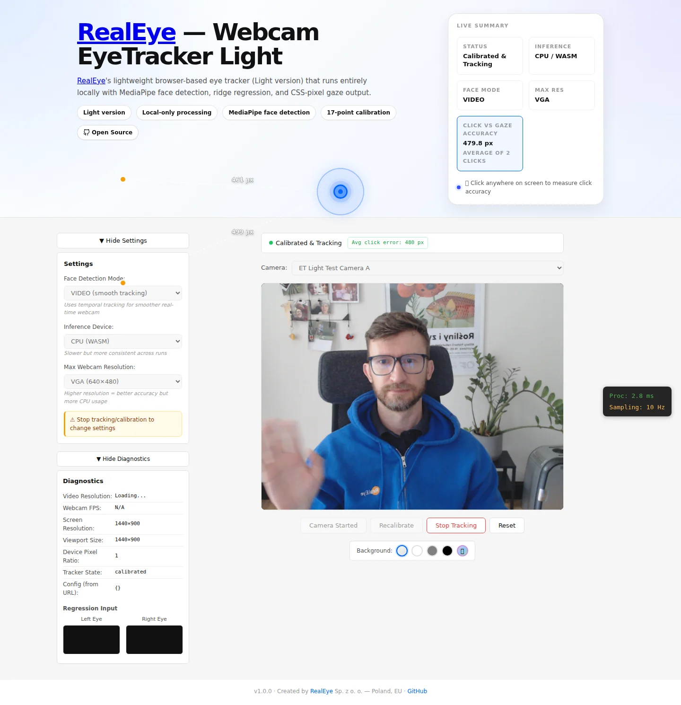

# RealEye Webcam EyeTracker Light Open

> **🚀 This technology powers [RealEye.io](https://www.realeye.io)** — the commercial webcam eyetracking platform with heatmaps, gaze plots, and areas of interest. [Learn more about real-world online webcam eyetracking →](https://www.realeye.io/features/online-webcam-eyetracking)

[](https://www.npmjs.com/package/@realeye-io/webcam-eyetracker-light-open)
[](./LICENSE)
[](https://www.npmjs.com/package/@realeye-io/webcam-eyetracker-light-open)
[](https://www.typescriptlang.org/)
[](https://nodejs.org/)

**👉 Try the live demo: [webcam-eyetracker-light-open demo](https://realeye-io.github.io/webcam-eyetracker-light-open/)**

RealEye Webcam EyeTracker Light Open is a webcam eye-tracker running in your web browser that provides on-screen gaze coordinates. It works with any regular camera — laptop built-in webcam, USB webcam, or mobile device camera. Everything runs locally on your device. No external servers, no dedicated eye-tracking hardware required. Built in TypeScript with custom ridge regression.

## 🎯 Commercial Platform

This dual-licensed library is the core technology behind [RealEye.io](https://www.realeye.io), a commercial research platform that adds:

- **Heatmaps & gaze plots** from real users
- **Areas of Interest (AOIs)** and dwell-time metrics
- **Cloud storage & analytics**
- **Integration with testing tools**

[See RealEye.io in action →](https://www.realeye.io/features/online-webcam-eyetracking)

## ✨ Features

- **Zero setup** — no eye-tracking hardware required
- **Pure browser execution** — runs entirely client-side
- **No CDN dependencies** — all models served locally
- **17-point calibration** — proven optimal pattern
- **Head-pose compensation** — learned during calibration
- **TypeScript-first** — full type definitions included
- **100% self-contained** — no server-side dependencies
- **Interactive demo app** — calibration wizard, gaze trail animation, technical info panel, click accuracy overlay, webcam selection, background controls, and runtime diagnostics
- **≈ 120 CSS px accuracy** — average gaze error after 17-point calibration

## 📷 Camera Support

Works with any camera your browser can access — laptop built-in webcam, USB webcam, or mobile device camera.

**🖥️ Desktop recommended** — The demo application is designed for desktop/laptop browsers with a fixed webcam.

- Eye tracking requires facing the camera at a consistent distance and angle
- Calibration involves clicking small targets positioned across the entire screen
- Holding a phone at arm's length while trying to look at calibration targets is physically impractical
- The demo will show a warning banner on mobile devices; the app still runs but accuracy is significantly reduced

## 📸 Demo App

The demo app provides a full interactive experience: camera preview, face detection overlay, 17-point calibration wizard, and real-time gaze tracking.

**🌐 Live Demo** — Try it in your browser: [realeye-io.github.io/webcam-eyetracker-light-open](https://realeye-io.github.io/webcam-eyetracker-light-open/)

**Before calibration** — the initial landing screen with a **Start Camera** button (no webcam permission prompt until clicked):


**Ready for calibration** — face detected in a preview area, status set to Ready for Calibration, and **Start Calibration** enabled:


**During calibration** — the 17-point calibration wizard guides you through targets that appear across the screen. Progress is shown as each point is captured:


**During tracking** — calibrated gaze prediction with a gaze cursor, animated trail, and session statistics:


**Settings & Diagnostics** — expandable side panels for inference settings (Face Detection Mode, Inference Device, Max Resolution) and detailed diagnostics (video/viewport resolution, device pixel ratio, eye crop):



## 🚀 Quick Start

```bash
npm install @realeye-io/webcam-eyetracker-light-open
```

```typescript
import {
  WebcamETLight,
  getRecommendedPattern,
  getCalibrationPointsInPixels,
  type CalibrationSample,
} from '@realeye-io/webcam-eyetracker-light-open';

// Initialize
const tracker = new WebcamETLight({ delegate: 'GPU' });
await tracker.initialize();

// Build calibration samples using the recommended 17-point grid
const pattern = getRecommendedPattern(); // GRID_17
const points = getCalibrationPointsInPixels(
  pattern,
  window.innerWidth,
  window.innerHeight
);

const samples: CalibrationSample[] = [];
for (const point of points) {
  // Capture a webcam frame while the user looks at the target
  const imageData = await captureCalibrationFrame(point);
  samples.push({
    image: imageData,
    gazeX: point.x,
    gazeY: point.y,
  });
}

// Fit the ridge regression model
tracker.calibrate(samples);

// Predict gaze (synchronous)
const gazePoint = tracker.predict(liveFrame);
if (gazePoint) {
  console.log(`Gaze at: (${gazePoint.x}, ${gazePoint.y})`);
}
```

> **Tip:** See the [User Manual](USER_MANUAL.md) for a step-by-step walkthrough of the included demo app.

## 📖 Table of Contents

- [User Manual](USER_MANUAL.md) — step-by-step guide for the demo app
- [API Reference](#-api-reference)
  - [WebcamETLight Methods](#webcametlight)
  - [Calibration Utilities](#calibration-utilities)
  - [Data Types](#calibration-data-types)
  - [Error Handling](#error-handling)
- [Calibration Pattern](#-calibration-pattern)
- [Technical Architecture](#-technical-architecture)
  - [Feature Extraction](#feature-extraction)
  - [Ridge Regression](#ridge-regression)
  - [Coordinate System](#coordinate-system)
  - [Configuration Constants](#configuration-constants)
- [Project Structure](#-project-structure)
- [Testing](#-testing)
- [Contributing](#-contributing)
- [Changelog](CHANGELOG.md)
- [Security](SECURITY.md)
- [License](#-license)
- [Third-Party Notices](THIRD_PARTY_NOTICES.md)
- [Links](#-links)

## 🔌 API Reference

### WebcamETLight

```typescript
import { WebcamETLight, WebcamETLightConfig } from '@realeye-io/webcam-eyetracker-light-open';

const tracker = new WebcamETLight({
  delegate: 'GPU',              // 'GPU' | 'CPU'
  faceDetectorMode: 'landmarker', // 'landmarker' | 'blazeFace'
  modelPath: 'models/face_landmarker.task',
  wasmPath: 'wasm',
  runningMode: 'VIDEO',         // 'VIDEO' | 'IMAGE'
  ridgeLambda: 1e-5,
  minDetectionConfidence: 0.5,
  useLandmarks: true,
});

await tracker.initialize();
const gaze = tracker.predict(image); // GazePoint | null
```

#### Instance Methods

| Method | Description |
|--------|-------------|
| `initialize()` | Load MediaPipe models and face detector |
| `predict(imageData: ImageData): GazePoint \| null` | Return predicted gaze in CSS pixels |
| `calibrate(samples: CalibrationSample[])` | Fit ridge regression on samples |
| `getState(): TrackerState` | Return current tracker state |
| `isReady(): boolean` | Check if initialized and ready |
| `isCalibrated(): boolean` | Check if calibration has been applied |
| `detectFace(image): FaceDetectionResult \| null` | Detect face with landmarks in an image |
| `dispose()` | Release MediaPipe resources |

### Calibration Utilities

Standalone functions exported from the library (not methods on `WebcamETLight`):

| Function | Description |
|----------|-------------|
| `getRecommendedPattern()` | Return the recommended `CalibrationPattern` (GRID_17) |
| `getCalibrationPoints(pattern): CalibrationPoint[]` | Get pattern points normalized 0–1 |
| `getCalibrationPointsInPixels(pattern, width, height)` | Get pattern in screen-pixel coordinates |
| `toScreenCoordinates(points, width, height)` | Convert normalized points to screen pixels |
| `getPatternInfo(pattern)` | Get metadata for a calibration pattern |

### Calibration Data Types

```typescript
interface CalibrationSample {
  image: ImageData;   // Webcam frame
  gazeX: number;      // Screen X in CSS pixels
  gazeY: number;      // Screen Y in CSS pixels
}

interface GazePoint {
  x: number;          // CSS pixels
  y: number;          // CSS pixels
}
```

### Error Handling

If face detection fails, `predict()` returns `null`. The library emits clear error states for missing calibration, initialization failures, and low detection confidence.

## 🎯 Calibration Pattern

The project uses a single **17-point grid** calibration pattern, selected for strong full-screen coverage and stable accuracy across corners, edges, center, and intermediate regions.

### 17-Point Grid Layout

```
┌─────────────────────────────────────────────┐
│  (0.05,0.05)    (0.50,0.05)   (0.95,0.05)  │
│                                             │
│  (0.05,0.25)    (0.25,0.25)   (0.50,0.25)   (0.75,0.25)   (0.95,0.25)│
│                                             │
│  (0.05,0.50)    (0.50,0.50)   (0.95,0.50)  │
│                                             │
│  (0.05,0.75)    (0.25,0.75)   (0.50,0.75)   (0.75,0.75)   (0.95,0.75)│
│                                             │
│  (0.05,0.95)    (0.50,0.95)   (0.95,0.95)  │
└─────────────────────────────────────────────┘
```

```typescript
import { 
  CalibrationPattern, 
  getRecommendedPattern,
  getCalibrationPoints,
  getCalibrationPointsInPixels,
} from '@realeye-io/webcam-eyetracker-light-open';

const pattern = getRecommendedPattern(); // GRID_17
const normalized = getCalibrationPoints(pattern);
const screen = getCalibrationPointsInPixels(pattern, w, h);
// → [{ x: 85, y: 85 }, { x: 800, y: 85 }, ...]
```

## 🏗 Technical Architecture

### Feature Extraction

For each webcam frame:

1. **Face detection** — MediaPipe Face Landmarker (default), BlazeFace fallback
2. **Landmark coordinates** — 15 key points × 2 (x, y) = 30 features
3. **Blendshapes** — 22 semantic facial parameters (eye blink, brow raise, look direction, ...)
4. **Eye crops** — left + right regions resized to 40×20 pixels each (800 px total)
5. **Z-score + bias** — normalize and append 1.0

**Feature counts:**

| Mode | Features | Breakdown |
|------|----------|-----------|
| Landmarker | **1,653** | 30 + 22 + 2×(40×20) + 1 |
| BlazeFace | **1,622** | 21 + 2×(40×20) + 1 |
| Landmarks off | **257** | 16×16 face crop + bias |

### Demo Application

The included demo app provides a fully-featured interactive playground:

- **Privacy-first startup** — no webcam permission prompt on load; preview starts only after clicking **Start Camera**

- **17-Point Calibration Wizard** — interactive point-by-point calibration overlay
- **Real-time Gaze Tracking** — live gaze cursor with animated trail effect
- **Technical Info Panel** — collapsible sidebar showing webcam resolution/FPS, tracker configuration (inference device, feature count, calibration points), and runtime metrics (processing time, sampling rate, prediction count, tracking duration)
- **Click Accuracy Overlay** — click anywhere during tracking to see gaze-vs-click distance lines with average error
- **Gaze Trail Effect** — animated trailing dots that visualize recent gaze movement
- **Background Color Controls** — test tracking against different backgrounds (default, white, gray, black, random)
- **Webcam Selector** — enumerate and switch between connected cameras with resolution presets (VGA through 4K)
- **Session Stats** — gaze prediction count and tracking duration counter
- **Diagnostics Panel** — optional deep-dive with video resolution, screen/viewport info, device pixel ratio, and raw eye crop previews

```bash
# Run the demo locally
npm install
npm run dev
# Opens at http://localhost:8089
```

### Ridge Regression

- **Input:** 1,653-element feature vector  
- **Output:** Gaze `{ x, y }` in CSS pixels  
- **Training:** Solve `(XᵀX + λI)β = Xᵀy`  
- **Lambda:** `1e-5` (insensitive to change)  
- X & Y trained independently  
- Matrix operations use [`ml-matrix`](https://www.npmjs.com/package/ml-matrix); the ridge regression algorithm itself is custom-implemented

### Coordinate System

- Origin: top-left of viewport
- X grows right, Y grows down
- Units: CSS pixels

### Configuration Constants

| Constant | Value | Description |
|----------|-------|-------------|
| `EYE_INPUT_WIDTH` | 40 | Regression input width |
| `EYE_INPUT_HEIGHT` | 20 | Regression input height (2:1) |
| `EYE_BOX_SCALE` | 1.2 | Bounding-box expansion |
| `EYE_CROP_PADDING` | 4 | Augmentation pixel margin |
| `AUGMENTATION_OFFSETS` | ±1 px | 9 shifts per capture |
| `DEFAULT_FEATURE_COUNT` | 1,653 | Total features |
| `RIDGE_LAMBDA` | 1e-5 | Regularization |
| `MIN_CALIBRATION_SAMPLES` | 5 | Minimum samples required |
| `MIN_DETECTION_CONFIDENCE` | 0.5 | Face detection threshold |

## 📂 Project Structure

```
webcam-eyetracker-light-open/
├── README.md                          # This file
├── CONTRIBUTING.md                    # How to contribute
├── CHANGELOG.md                       # Version history
├── package.json
├── tsconfig.json
├── tsconfig.lib.json
├── vitest.config.ts
├── playwright.config.ts
├── webpack.config.js
├── eslint.config.js
│
├── public/
│   └── models/                         # MediaPipe models
│       ├── blaze_face_short_range.tflite
│       └── face_landmarker.task
│
├── lib/                                # Core library
│   ├── index.ts                        # All public exports
│   ├── WebcamETLight.ts                # Main tracker class
│   ├── types.ts                        # TypeScript interfaces
│   ├── calibration/
│   │   └── CalibrationPatterns.ts
│   ├── math/
│   │   ├── matrix.ts                   # Ridge regression math
│   │   └── matrix-optimized.ts
│   ├── face/
│   │   ├── FaceDetector.ts
│   │   ├── FaceLandmarkerAdapter.ts
│   │   └── BlazeFaceAdapter.ts
│   └── features/
│       ├── FeatureExtractor.ts
│       ├── EyeBoxScale.ts
│       ├── FeatureConfig.ts
│       └── HeadPoseAugmentation.ts
│
├── apps/
│   └── demo_app/                       # Demo (React 18)
│       ├── App.tsx
│       ├── index.tsx
│       ├── demo_app.md                 # Demo app technical documentation
│       ├── components/
│       └── styles/
│
└── tests/                             # Tests (unit & e2e)
  ├── unit/                           # Vitest unit tests
  └── e2e/                            # Playwright E2E
```

## 🧪 Testing

> This project uses [RealTesting Open](https://github.com/RealEye-io/realtesting-open) — a library making it easier to write acceptance tests of web browser apps using webcam, screen recording, full screen mode, WebRTC and more. E2E tests in this repository leverage RealTesting for virtual camera simulation and browser testing.

```bash
npm run test:unit                        # Vitest unit tests
npm run test:e2e                         # Playwright E2E (virtual camera)
npm run test:css                         # CSS rendering tests
npm run test:screenshot                  # Screenshot capture tests
npm test                                 # All default test gates
npm run lint                             # ESLint
npm run lint:fix                         # ESLint with auto-fix
npm run typecheck                        # TypeScript type checking (no emit)
npm run build                            # Build library + demo
npm run build:lib                        # Compile library only (for npm publish)
npm run build:demo                       # Production demo build
npm run test:watch                       # Watch mode for unit tests
```

## 🤝 Contributing

See [CONTRIBUTING.md](CONTRIBUTING.md) for:
- Development environment setup
- Coding standards (TypeScript strict, ESLint)
- Pull-request process
- Calibration and tracking quality guidance

When submitting changes that affect prediction accuracy:
- Update calibration tests
- Include example frames if landmark mapping changes
- Re-run `npm test` for regression checks

## 📄 License

Copyright © 2025-2026 RealEye sp. z o.o.

This project (the eye-tracker library and the demo application) was created by [Damian Sromek](https://www.linkedin.com/in/damiansromek/).

This repository is available under **either** of the following licenses:

1. **GNU AGPL v3 or later** — see [LICENSE-AGPL.md](LICENSE-AGPL.md)
2. **Commercial license** — see [LICENSE-COMMERCIAL.md](LICENSE-COMMERCIAL.md)

### No-fee commercial path

Under the commercial option, you may use the project **without a license fee** if you qualify as either:

- a company whose qualifying valuation, acquisition value, or fallback trailing-twelve-month revenue does not exceed **USD $1,000,000**, including Affiliates; or
- a university, academic, or nonprofit research project whose project or lab grant funding does not exceed **USD $1,000,000**.

If you exceed those thresholds, or if you need written commercial terms beyond the no-fee allowance, use the paid commercial license path described in [LICENSE-COMMERCIAL.md](LICENSE-COMMERCIAL.md).

Third-party components remain subject to their own licenses. See [THIRD_PARTY_NOTICES.md](THIRD_PARTY_NOTICES.md) and [public/models/README.md](public/models/README.md).

## 🔗 Links

- [npm package](https://www.npmjs.com/package/@realeye-io/webcam-eyetracker-light-open)
- [RealEye.io — webcam eyetracking platform](https://www.realeye.io/features/online-webcam-eyetracking)
- [GitHub repository](https://github.com/RealEye-io/webcam-eyetracker-light-open)
- [Issues](https://github.com/RealEye-io/webcam-eyetracker-light-open/issues)
- [User Manual](USER_MANUAL.md) — step-by-step demo guide
- [Demo App Docs](apps/demo_app/demo_app.md) — technical demo documentation
- [MediaPipe Models](public/models/README.md) — local model hosting details
- [Third-Party Notices](THIRD_PARTY_NOTICES.md) — dependency and model attributions
- [Changelog](CHANGELOG.md) — version history
- [Security Policy](SECURITY.md) — vulnerability reporting
- [RealTesting Open](https://github.com/RealEye-io/realtesting-open) — browser acceptance testing library (webcam, screen recording, WebRTC, and more)

---

*Made with ❤️ by [RealEye](https://www.realeye.io)*
