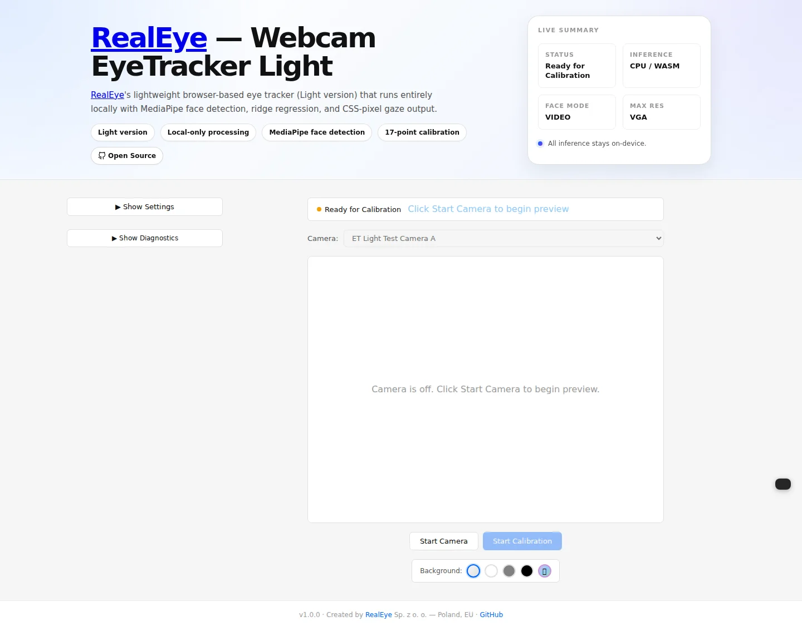
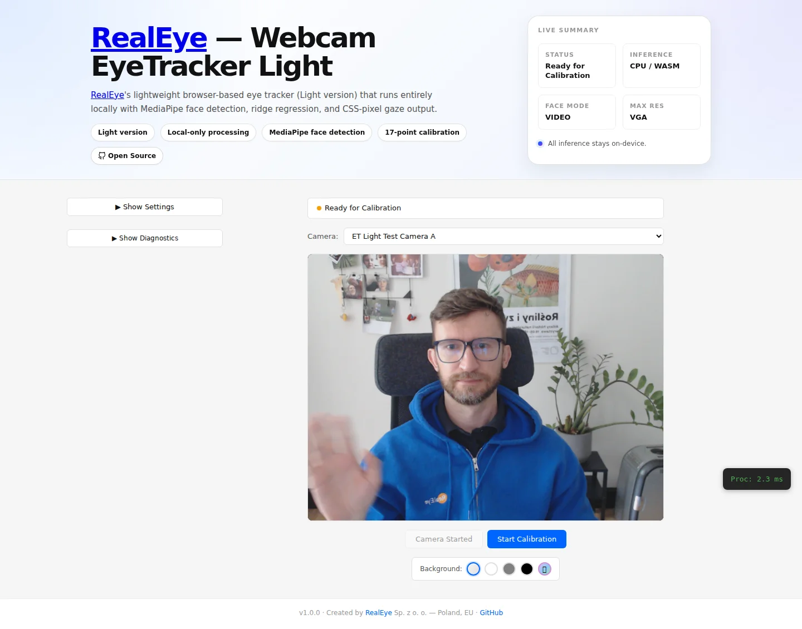
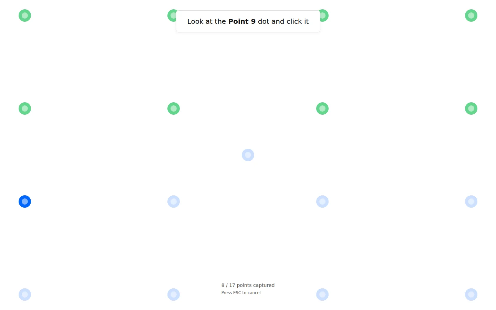
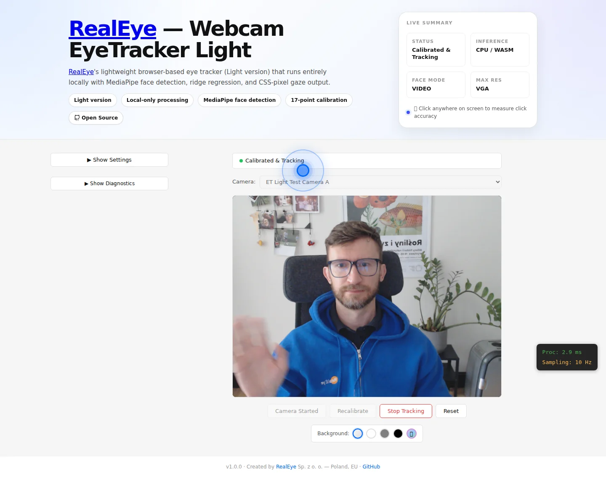

# RealEye Webcam EyeTracker Light Open — User Manual

Welcome to the RealEye Webcam EyeTracker Light Open user manual. This guide walks you through the interactive demo application, explaining every feature, screen, and setting in plain language.

> **What is this?** A browser-based eye-tracker that lets you calibrate and predict gaze position using only your webcam — no special hardware, no external servers. All processing stays on your device.

---

## Table of Contents

- [System Requirements](#system-requirements)
- [Device Compatibility](#device-compatibility)
- [Getting Started](#getting-started)
- [Step-by-Step Walkthrough](#step-by-step-walkthrough)
  - [1. Landing Screen](#1-landing-screen)
  - [2. Camera Preview & Face Detection](#2-camera-preview--face-detection)
  - [3. Calibration Wizard](#3-calibration-wizard)
  - [4. Gaze Tracking](#4-gaze-tracking)
  - [5. Settings & Diagnostics](#5-settings--diagnostics)
- [Features Reference](#features-reference)
  - [Webcam Preview](#webcam-preview)
  - [Face Detection Overlay](#face-detection-overlay)
  - [17-Point Calibration Wizard](#17-point-calibration-wizard)
  - [Real-Time Gaze Tracking](#real-time-gaze-tracking)
  - [Gaze Trail Effect](#gaze-trail-effect)
  - [Click Accuracy Overlay](#click-accuracy-overlay)
  - [Technical Info Panel](#technical-info-panel)
  - [Settings Panel](#settings-panel)
  - [Webcam Selector](#webcam-selector)
  - [Background Color Controls](#background-color-controls)
  - [Session Statistics](#session-statistics)
- [Troubleshooting](#troubleshooting)
- [Frequently Asked Questions](#frequently-asked-questions)

---

## System Requirements

| Requirement | Details |
|-------------|---------|
| **Browser** | Chrome 90+, Firefox 88+, Safari 14+, Edge 90+ |
| **Webcam** | Any standard USB or built-in camera |
| **Network** | None required (all processing is local) |
| **OS** | Windows 10+, macOS 11+, Linux (any modern distro) |
| **Performance** | 30+ FPS target on modern laptops |
| **Device** | Desktop or laptop computer recommended. Mobile devices are not optimized — see [Device Compatibility](#device-compatibility) |

---

## Device Compatibility

This demo application is optimized for **desktop and laptop computers** with a fixed webcam.

**Why desktop is recommended:**
- Eye tracking requires your face to be at a consistent distance and angle from the camera
- Calibration involves clicking small targets positioned across the entire screen
- Holding a phone at arm's length while trying to look at calibration targets is physically impractical

**If you're on a mobile device:**
- You'll see a warning banner when you open the app
- The app will still function, but accuracy will be significantly reduced
- Calibration targets are larger on mobile, but the physical setup limitation remains

---

## Getting Started

The demo application is included in this repository and can be launched locally:

```bash
# Clone the repository
git clone https://github.com/RealEye-io/webcam-eyetracker-light-open.git
cd webcam-eyetracker-light-open

# Install dependencies
npm install

# Start the development server
npm run dev
```

Open your browser and navigate to `http://localhost:8089`. The demo is now ready.

> **Tip:** You can also use the library in your own project via `npm install @realeye-io/webcam-eyetracker-light-open`. See [README.md](README.md) for the API reference, or the [Contributing Guide](CONTRIBUTING.md) for development setup.

---

## Step-by-Step Walkthrough

### 1. Landing Screen

When you first open the demo, you'll see the landing screen:



**What you see:**
- **Header bar** — shows the app title, version number, and a status indicator (`Ready for Calibration`).
- **Key highlights** — a summary of the tracker capabilities: privacy-first, MediaPipe-based detection, 17-point calibration system, and CSS-pixel output.
- **"Start Camera" button** — clicking this will trigger the browser's camera permission prompt.
- **Webcam Selector** — shows available cameras (disabled until camera is started).
- **Background controls** — buttons to change the background color.

**What to do:**
Click **Start Camera** to begin. The app will not request camera access until you click this button — your webcam feed stays off otherwise.

---

### 2. Camera Preview & Face Detection

After starting the camera, you'll see your webcam feed with a real-time face detection overlay:



**What you see:**
- **Webcam preview** — your live camera feed.
- **Face detection box** — a rectangle drawn around your detected face, updating in real-time.
- **Status** — the header shows `Ready for Calibration`.
- **Start Calibration button** — enabled now that the system has detected your face.

**What happens behind the scenes:**
- The MediaPipe Face Landmarker is analyzing your face at 30+ FPS.
- It detects 478 facial landmarks, iris positions, and 22 blendshape parameters.
- No data leaves your device — everything runs locally via WebGL (GPU) or WASM (CPU).

**What to do:**
Position your face within the detection box. Make sure your face is well-lit. Once the **Start Calibration** button is active, proceed to step 3.

---

### 3. Calibration Wizard

Clicking "Start Calibration" launches the 17-point calibration wizard:



**What you see:**
- **Calibration targets** — circular markers appear at specific positions across your screen (corners, edges, center, and intermediate grid points).
- **Progress indicator** — shows how many points you've completed (e.g., `8 / 17`).
- **Calibration instructions** — tells you to look at the current target (the pulsing circle).

**How it works:**
1. A circular target appears at a screen position.
2. The system captures multiple frames of your face as you look at it.
3. It extracts 1,653 features from each frame (landmarks, blendshapes, eye crop pixels).
4. Click to confirm the target is complete and move to the next point.
5. Repeat for all 17 points.

**What to do:**
- Move your head so your gaze is directed at the current target circle.
- Stay as still as possible while the system captures your face data.
- Click the calibration point to move to the next one.
- Complete all 17 points for the best calibration quality.

> **Tip:** The 17-point grid is the recommended pattern, chosen because it covers corners, edges, center, and inner regions — giving the best accuracy across the entire screen.

---

### 4. Gaze Tracking

After calibration is complete, you can start the gaze tracking:



**What you see:**
- **Gaze cursor** — a colored dot that represents your predicted gaze position on the screen. It moves in real-time as your eyes look around.
  - **Blue** — your face is currently detected.
  - **Red** — face detection has been lost (gaze position is the last known estimate).
- **Gaze trail** — a fading trail of small dots following the cursor, showing your recent gaze path.
- **Session stats** — the number of predictions made and how long tracking has been active.
- **Stop Tracking button** — click this to pause tracking.

**How it works:**
- For every webcam frame, the system:
  1. Detects your face and extracts landmarks.
  2. Extracts the 1,653 feature vector.
  3. Applies the ridge regression model trained during calibration.
  4. Outputs a `{ x, y }` point in CSS pixels.
- If your face is not detected, `predict()` returns `null` — no guess position.

---

### 5. Settings & Diagnostics

While tracking, you can expand the Settings and Diagnostics panels:


**What you see:**
- **Settings panel** — three configuration options (detailed in the [Settings Panel](#settings-panel) section below).
- **Diagnostics panel** — shows detailed runtime info: video resolution, viewport dimensions, device pixel ratio, and raw eye crop previews.

**What to do:**
- Use settings to adjust inference mode, device, or resolution (requires stopping tracking first).
- Use diagnostics to inspect tracker internals and current configuration.

---

## Features Reference

### Webcam Preview

The live webcam feed is displayed as a fixed-size preview box. The tracker reads frames from this video element at the camera's native frame rate.

- **Resolution** — depends on your camera capabilities and the "Max Resolution" setting.
- **Orientation** — the preview uses standard orientation; if it appears upside-down on iOS devices, move the device to landscape and try again.

### Face Detection Overlay

A bounding box is drawn around your detected face within the webcam preview. This box:
- Updates at the camera's frame rate.
- Adapts to head movement and zooms as you move closer or farther from the camera.
- Provides visual confirmation that the face detector is tracking you correctly.

### 17-Point Calibration Wizard

The calibration process follows a 17-point grid pattern covering:
- **4 corners** — screen boundaries.
- **4 edge midpoints** — top, bottom, left, right centers.
- **1 center** — the middle of the screen (regression anchor).
- **8 intermediate points** — refining accuracy across the screen.

You must complete all 17 points for optimal accuracy. You can recalibrate at any time by clicking "Recalibrate" after the first calibration.

### Real-Time Gaze Tracking

During tracking, your predicted gaze position is displayed as an overlay dot:
- **Blue dot** — face is being actively detected.
- **Red dot** — face was not detected in the latest frame (shows last known position).
- The dot updates at approximately 30 Hz, matching the webcam frame rate.
- All coordinates are in CSS pixels with origin at the top-left corner.

### Gaze Trail Effect

A canvas-based animated trail follows the gaze cursor:
- **Trail dots** — fading circles that show your recent gaze path.
- **Glow effect** — each dot has a radial gradient glow for better visibility.
- **Automatic clear** — the trail clears when tracking stops.

The trail length and dot size are configurable in the component settings.

### Click Accuracy Overlay

During tracking, you can click anywhere on the page to measure how accurate the gaze prediction is at that moment:

1. Look at a spot on the screen.
2. Click the exact spot with your mouse.
3. A line is drawn between your gaze cursor (blue circle) and your click point (red cross).
4. The overlay shows:
   - **Distance in pixels** between gaze and click.
   - **Average error** across all clicks.
   - **Number of measurements** taken.

This is useful for understanding tracker accuracy at different regions of the screen.

### Technical Info Panel

An expandable sidebar that shows three categories of live information:

#### Webcam
- **Resolution** — the camera's current output resolution (e.g., `640×480`).
- **FPS** — the webcam's frames-per-second rate, reported by the MediaStream track settings.
- **Device** — the label of the currently selected camera.

#### Eye Tracker
- **State** — current tracker state (`Uninitialized`, `Ready`, `Calibrated`, `Error`).
- **Inference** — the active device (`GPU / WebGL` or `CPU / WASM`).
- **Face Mode** — detection mode (`VIDEO` for smooth temporal tracking, `IMAGE` for deterministic frame-by-frame).
- **Landmarks** — whether landmark-based features are enabled.
- **Features** — the total feature vector size (`1653` with landmarker enabled).
- **Calibration** — the number of calibration points used during the current session.
- **Ridge λ** — the regularization parameter (`1e-5`).

#### Runtime
- **Process Frame** — average frame processing time over the last 10 seconds (sliding window).
- **Sampling Rate** — gaze predictions per second during tracking (Hz).
- **Predictions** — total number of gaze predictions since tracking started.
- **Duration** — how long the current tracking session has been active.

### Settings Panel

Three configuration options are available in the Settings panel:

#### Face Detection Mode
- **VIDEO** — uses MediaPipe's temporal tracking pipeline for smooth, real-time webcam feeds. Default mode for live use.
- **IMAGE** — treats every frame independently. More deterministic, useful for testing and benchmarking.

#### Inference Device
- **GPU (WebGL)** — faster processing using the browser's GPU acceleration. Recommended for live usage.
- **CPU (WASM)** — slower but more consistent across different hardware and repeated runs. Useful for accuracy testing.

#### Max Webcam Resolution
Selects the upper limit for the camera's capture resolution:
- **VGA** — 640×480 (lowest, least CPU usage).
- **HD** — 1280×720.
- **Full HD** — 1920×1080.
- **QHD** — 2560×1440.
- **4K** — 3840×2160 (highest resolution, most CPU usage, best accuracy).

> **Note:** Settings can only be changed when tracking and calibration are stopped. A warning is shown if you try to change settings during an active session.

### Webcam Selector

The dropdown at the top of the main area lists all available camera devices:
- Click the dropdown to see all connected cameras.
- Select a different camera to switch the source (the current session will restart).
- Your last selection is saved in `localStorage` and restored on future visits.
- The selector is disabled while calibration or tracking is in progress.

### Background Color Controls

Five buttons let you change the page background:
- **Default** — light gray (`#f5f5f5`).
- **White** — plain white (`#ffffff`).
- **Gray** — medium gray (`#808080`).
- **Black** — dark (`#000000`).
- **🎲 Random** — generates a random hex color.

These controls help you test how different backgrounds affect face detection and gaze visibility.

### Session Statistics

During tracking, the status bar shows:
- **Prediction count** — the total number of gaze predictions produced since tracking started. This increases at approximately 30 Hz (matching frame rate).
- **Tracking duration** — a running counter of how long the current tracking session has been active (minutes and seconds).

---

## Troubleshooting

### "Camera permission denied"

If the browser asks for camera access and you click "Block", the preview will stay black. To fix:
1. Click the lock icon in the browser's address bar.
2. Find the camera permission and set it to "Allow".
3. Refresh the page and click **Start Camera** again.

### "No face detected"

If the face detection box never appears:
- Make sure your face is well-lit (front-facing light is best).
- Move closer to the camera so your face fills at least part of the preview.
- Check that the correct webcam is selected in the Webcam Selector.
- Try switching the Face Detection Mode between `VIDEO` and `IMAGE` in Settings.

### Tracker shows red dot during tracking

The red dot means the detector temporarily lost your face. This can happen if:
- You turn your head too far from the camera.
- You move too quickly.
- Lighting changes drastically.

To recover, simply return your face to a clearly visible position.

### Poor tracking accuracy

If the gaze cursor seems far from your actual gaze:
1. **Recalibrate** — click the recalibrate button and redo the 17-point flow.
2. **Stay still** during each calibration point capture.
3. **Use higher resolution** — try Full HD or 4K in Settings (may reduce FPS but improve accuracy).
4. **Use GPU inference** — GPU mode is smoother for real-time tracking.

### App feels slow or lags

Try switching to:
- **CPU inference** — more stable on systems with limited GPU memory.
- **Lower resolution** — VGA or HD in Settings reduces CPU load.
- **IMAGE mode** — removes temporal tracking overhead.

---

## Frequently Asked Questions

### Is this the same as real hardware eye-trackers?

No. Hardware eye-trackers use infrared cameras and achieve much higher accuracy. This library uses standard webcams and computer vision, making it a practical, zero-cost alternative for web-based research and prototyping. Expect accuracy in the range of 100–200 pixels (varies by resolution and lighting).

### Does any data leave my device?

No. All face detection, landmark extraction, feature computation, and gaze prediction happen entirely in your browser. No video frames, model parameters, or predictions are sent to any server. See the [Security Policy](SECURITY.md) for full details on privacy-first design and vulnerability reporting.

### Can I use this in my own project?

Absolutely. This library is published as an npm package under the MIT license:

```bash
npm install @realeye-io/webcam-eyetracker-light-open
```

See [README.md](README.md) for the full API reference including TypeScript type definitions.

### Which browsers are supported?

| Browser | Minimum Version |
|---------|----------------|
| Chrome | 90+ |
| Firefox | 88+ |
| Safari | 14+ |
| Edge | 90+ |

The library requires WebGL for GPU inference and WASM for CPU inference.

### Why 17 calibration points?

The tracker is tuned around a 17-point grid because it balances calibration time with broad full-screen coverage. It captures corners, edges, center, and intermediate regions, which improves stability across typical viewport usage.

### Can I change the number of calibration samples per point?

The demo currently captures a fixed number of samples per calibration point. If you use the library programmatically, you can build a `CalibrationSample[]` array with multiple samples per point and pass it to `tracker.calibrate(samples)` to increase the training data. See the [API Reference](README.md#-api-reference) for details.

### How is gaze accuracy measured?

You can use the built-in Click Accuracy Overlay during tracking. Click on screen locations and observe the distance between your gaze cursor and your click. The overlay maintains a running average of all click distances.

### What if I have multiple webcams?

The Webcam Selector dropdown shows all detected cameras. Select your preferred one from the list. Your choice is remembered between visits.

---

*Made with ❤️ by [RealEye](https://www.realeye.io)*

For the developer guide, API reference, and technical architecture, see [README.md](README.md).
